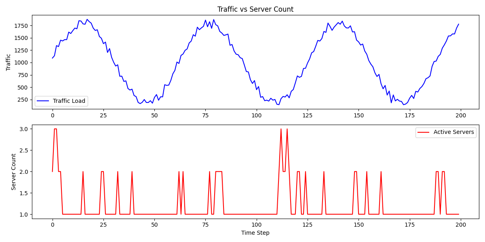

# ServerAutoScaling

Reinforcement Learning Project: Cloud Server Auto-scaling
📌 Project Overview
This project is submitted for the Reinforcement Learning course at Sogang University. The objective of this project is to design a Reinforcement Learning (RL) agent that optimizes cloud server auto-scaling. The agent learns to dynamically adjust the number of active servers based on fluctuating traffic patterns, aiming to minimize operational costs while maintaining service stability (avoiding overload).

🎯 Problem Definition
We formulated the auto-scaling problem as a Markov Decision Process (MDP) with the following components:

Environment
A custom OpenAI Gymnasium environment (ServerAutoScalingEnv) simulates a cloud infrastructure where user traffic follows a sine wave pattern with random noise.

Observation Space (State):
 - Current Traffic: The real-time volume of user requests.
 - Active Server Count: The number of servers currently running.

Action Space:
 - 0 (Hold): Maintain the current number of servers.
 - 1 (Scale Out): Add one server.
 - 2 (Scale In): Remove one server.

Reward Function:
 - Goal: Maximize Total Reward = Service Reliability - Operational Cost - Overload Penalty
 - Service Reliability: Positive reward for keeping the service alive.
 - Operational Cost: Negative reward proportional to the number of active servers.
- Overload Penalty: Significant negative reward if traffic exceeds capacity.

🛠️ Tech Stack & Algorithms
 - Language: Python 3.8+
 - Libraries: gymnasium, stable-baselines3, numpy, matplotlib
 - Algorithm: Proximal Policy Optimization (PPO)
  : PPO was chosen for its stability and ease of hyperparameter tuning in continuous or discrete action spaces.

🚀 How to Run
1. Clone the repository
Bash
git clone https://github.com/sgjskim00/ServerAutoScaling.git
cd ServerAutoScaling

2. Install dependencies
Bash
pip install gymnasium stable-baselines3 shimmy matplotlib

3.Run the training script
Bash
python run_project.py

📊 Experimental Results
After training for 10,000 timesteps, the agent successfully learned the traffic pattern.
- Graph Analysis: As shown in the result graph, the Active Server Count (Red line) dynamically follows the Traffic Load (Blue line).
- Performance: The agent minimizes idle servers during low traffic (saving costs) and proactively scales out during high traffic (preventing overload).

)_
